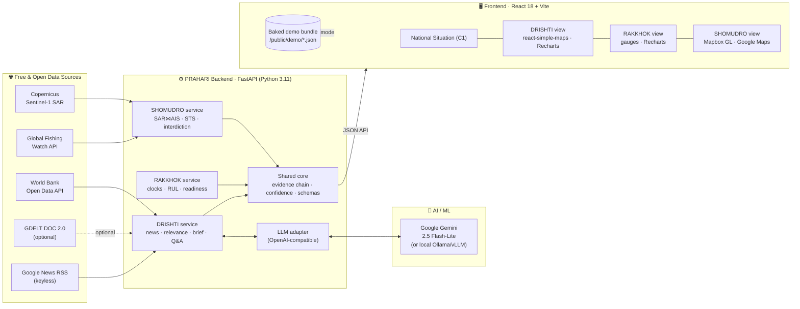
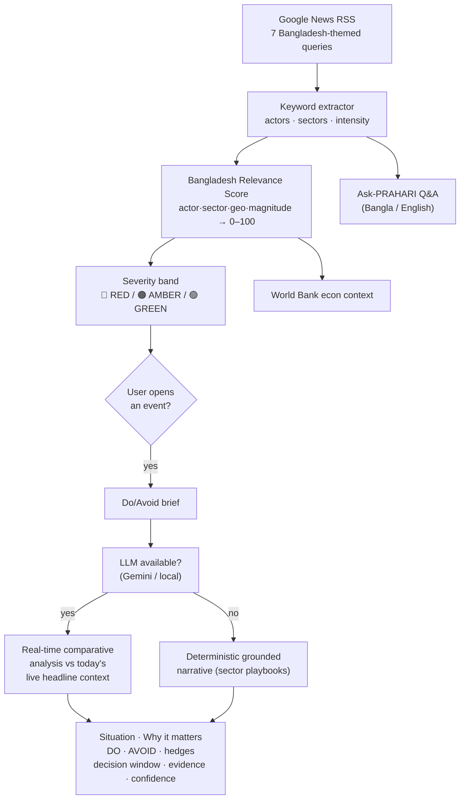
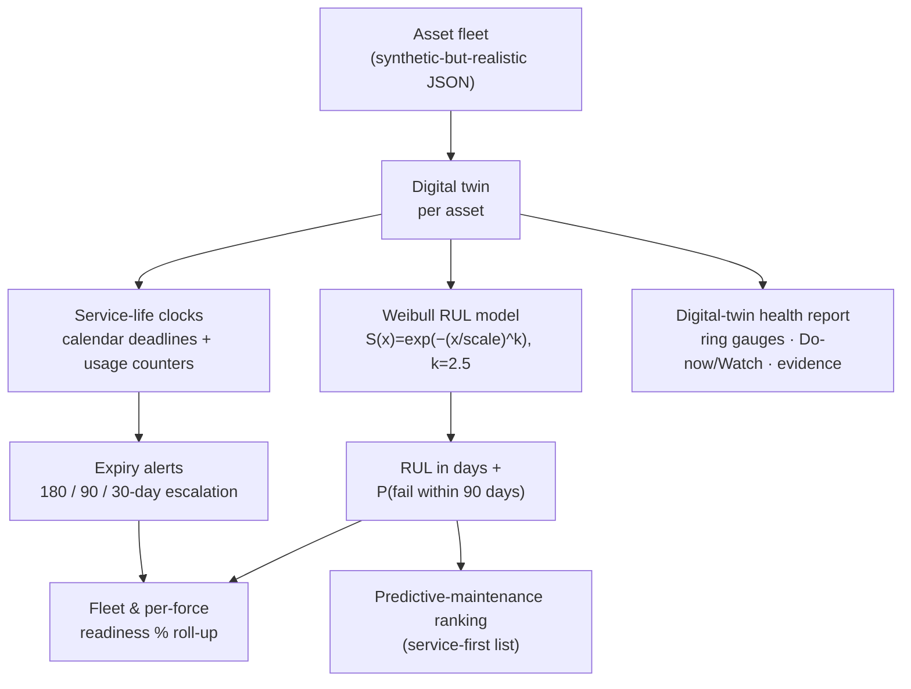
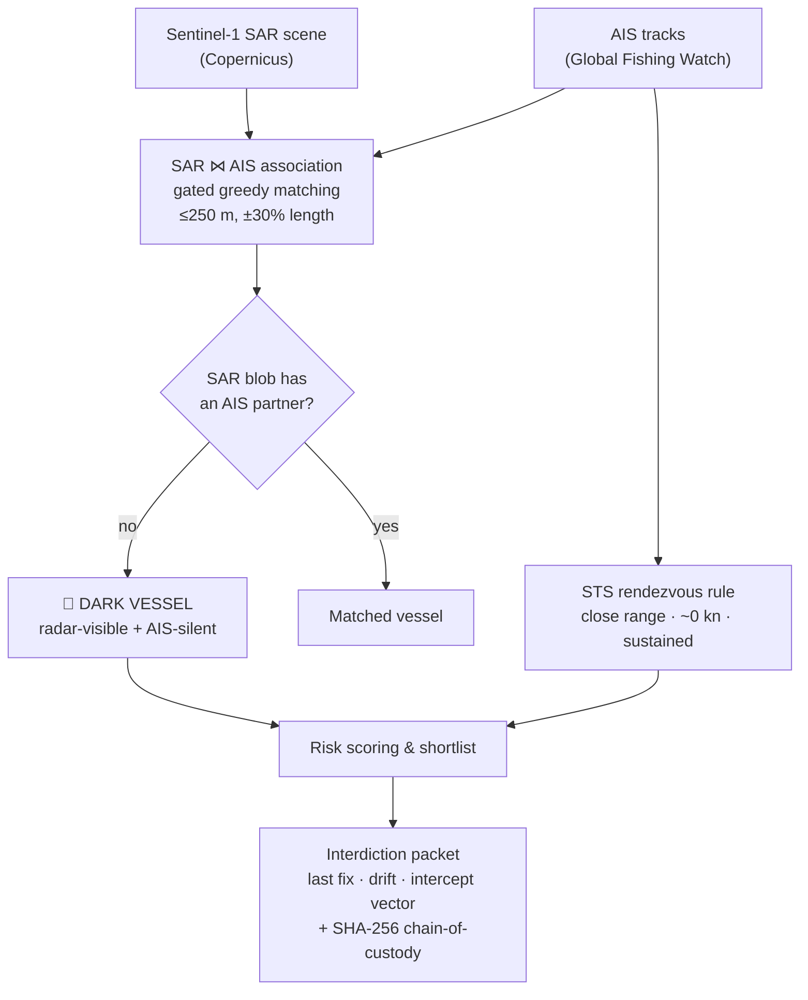

<div align="center">

# 🛡️ PRAHARI — *The Sentinel*

### National Strategic Intelligence & Defense Readiness for Bangladesh

**দৃষ্টি · রক্ষক · সমুদ্র** — one sovereign, bilingual, air-gappable brain that answers, every day:
### *"What is best for Bangladesh — and what must Bangladesh avoid?"*

<br/>

[](https://prahari.vercel.app)
&nbsp;
[](https://prahari-backend-5b6b.onrender.com/docs)


<br/>


**by [DatourX](#-team--datourx)** · Live: **[prahari.vercel.app](https://prahari.vercel.app)** · API: **[prahari-backend-5b6b.onrender.com](https://prahari-backend-5b6b.onrender.com)**

</div>

---

## 📖 Overview

> **The data already exists. The intelligence does not.**

Every day, decisions that shape Bangladesh's future are made somewhere in the noise of open data — a third-country port deal that reshapes the Bay of Bengal, a new tariff line that threatens a million garment jobs, a dark vessel running contraband through the Exclusive Economic Zone, a patrol aircraft quietly grounded by one expired component. Today these signals are discovered **reactively, weeks after the decision window has closed**. The analysis is scattered across ministries and services, with no shared picture, no institutional memory, and — most dangerously — no *evidence trail* behind the judgment calls.

**PRAHARI** (Bengali: প্রহরী, *"The Sentinel"*) is an AI decision-support platform that turns free, open, real-time data into a **recommendation with the evidence attached**. It watches three domains at once — geopolitics, defense readiness, and the maritime frontier — and for every event it surfaces, it answers the only question that matters for a small state at a great-power crossroads: *what should Bangladesh do, and what should it avoid?* It never pulls a trigger. It makes sure the people who do act with the full picture.

Sovereignty is a design constraint, not a slogan. PRAHARI runs entirely on **free and open data sources** and a **pluggable, air-gappable LLM layer** — point it at Google Gemini for the hosted demo, or at a locally-hosted open-weight model (Ollama / vLLM) inside national infrastructure, and *nothing sensitive ever has to leave the country*. Every score, brief, and alert carries its **evidence chain and a confidence figure**, and the system will refuse to answer on thin evidence rather than hallucinate. It is bilingual by design — Bangla is a first-class citizen alongside English, in the UI and in the AI's own reasoning.

---

## ✨ Non-Negotiable Design Laws

These seven laws govern every line of code and every pixel:

1. **🇧🇩 Bangladesh-first** — every output ends in a *recommendation scored for national interest*, never just a summary.
2. **🧑‍✈️ Human-in-the-loop** — PRAHARI **advises; authorized officers decide.** No autonomous action, ever.
3. **🔍 Explainability is P0** — every number carries its **evidence chain, sources, and confidence**. On low evidence it *refuses* rather than guesses.
4. **🔒 Sovereign & air-gappable** — the LLM layer is a thin adapter over any OpenAI-compatible endpoint, so it runs equally against a hosted API or a local open-weight model behind an air gap.
5. **🆓 Open-data-first** — the entire MVP runs on free public data: Google News, GDELT, World Bank, Global Fishing Watch, Copernicus Sentinel-1.
6. **🌐 Bilingual by design** — Bangla + English throughout the UI *and* the generated intelligence.
7. **⚖️ Legal & proportionate** — maritime analysis tracks *vessels and states, never private citizens*; interdiction packets are built with chain-of-custody hashes for admissibility.

---

## 🧩 Three Modules, One Sentinel

PRAHARI is three domain modules riding one shared explainability core, unified by a single **National Situation** page.

| | Module | Bangla | Domain | In one line |
|---|---|---|---|---|
| 🛰️ | **DRISHTI** | দৃষ্টি *(Vision)* | Geopolitical & diplomatic intelligence | Real-time world news → a **Bangladesh Relevance Score** → an AI **Do / Avoid brief** with citations. |
| 🛡️ | **RAKKHOK** | রক্ষক *(Guardian)* | Defense asset lifecycle & readiness | Digital twin per asset → service-life clocks + **Weibull RUL** prediction → **fleet-readiness %**. |
| 🌊 | **SHOMUDRO** | সমুদ্র *(Sea)* | Maritime domain awareness | Sentinel-1 SAR **⋈** AIS → *radar-visible + AIS-silent = a **dark vessel*** → an **interdiction packet**. |

Two cross-cutting capabilities bind them:

- **National Situation (C1)** — a unified national-posture gauge, three module status cards, and a single cross-module alert stream.
- **Explainability (C3)** — every score, brief, and alert exposes its evidence chain and confidence, everywhere in the UI.

---

## 🚀 Key Features

### 🛰️ DRISHTI — Geopolitical & Diplomatic Intelligence
- **Real-time event radar** from live **Google News RSS** (free, keyless) across seven Bangladesh-critical query themes — trade/RMG, India/Teesta, China/ports, Myanmar/Rohingya, remittances/Gulf labour, energy, and diplomacy.
- **Transparent event extraction** — a fully auditable keyword engine tags each headline with actors, policy sectors, and a cooperation/conflict intensity signal (no black box).
- **Bangladesh Relevance Score (0–100)** decomposed into four weighted, human-readable components — *actor relevance (40%) · sector relevance (30%) · geographic proximity (15%) · event magnitude (15%)* — each carrying the reason it contributed, plus a RED / AMBER / GREEN severity band.
- **Do / Avoid Advisor briefs** — a two-column national-interest brief (recommended actions vs. actions to avoid) generated by **Google Gemini** as a *real-time comparative analysis*: an event is analysed against **today's live headline context**, so an older item is always read against what partners are doing *now*. A deterministic, grounded fallback runs when no LLM is configured, and the module **refuses** below a confidence floor.
- **World Bank economic context** — remittances, GDP, reserves, and trade indicators for Bangladesh.
- **Rich command-center UI** — an animated world map (react-simple-maps) with pulsing actor markers and arcs to Dhaka, sentiment/actor/trend charts and sector & severity donuts (Recharts), an early-warning board, region-focus tiles, a live news wall with trending topics, and **Ask-PRAHARI** bilingual Q&A grounded in the feed.
- **Live by default** — the deployed site loads an instant baked snapshot, then polls the live backend every 5 minutes for fresh events and freshly-generated briefs.

### 🛡️ RAKKHOK — Defense Asset Readiness
- **Digital twin per asset** with multiple **service-life "clocks"** (calendar deadlines and usage counters) and escalating **180 / 90 / 30-day expiry alerts**.
- **Remaining-Useful-Life (RUL) prediction** via **Weibull survival analysis** on the driving usage counter, reporting RUL in days *and* the conditional probability of failure within 90 days.
- **Fleet & per-force readiness %** roll-up (mission-capable rates) with red/amber alert counts.
- **Predictive-maintenance ranking** — the "service this one first" list, ordered by failure risk.
- **Failure-risk data table** with **real equipment photos** (fetched by platform class from the Wikipedia/Wikimedia REST API, silhouette fallback), status pills, and per-asset risk bars.
- **Digital-twin health report** — ring gauges (mission-capable, Weibull RUL, 90-day failure risk), service-life countdown clocks, maintenance *Do-now / Watch* recommendations, and an evidence chain per asset.
- Asset data is **synthetic-but-realistic** — real defense data is classified; the demo is honest about this.

### 🌊 SHOMUDRO — Maritime Domain Awareness
- **Sentinel-1 SAR ⋈ AIS cross-correlation** — radar detections are matched to AIS tracks by a transparent, gated greedy assignment (a stand-in for Hungarian matching). A detection with **no valid AIS partner is DARK**: seen by radar, silent on AIS.
- **Ship-to-ship (STS) rendezvous detection** — the classic loitering-encounter rule (close range, near-zero speed, sustained duration).
- **Interdiction packets** — last fix, drift prediction, nearest patrol asset, intercept vector and ETA, plus a **SHA-256 chain-of-custody hash** for evidence integrity.
- **Dual-provider tactical map** — **Mapbox GL JS** (3D terrain, sky layer, multiple designed styles) and **Google Maps JS API** (satellite/dark), with ship-icon markers, a SAR-scene raster overlay, per-layer toggles, and a contact profile HUD (radar chips, confidence bars, evidence reasons).

---

## 🏗️ Architecture

PRAHARI's MVP is a **single deployable FastAPI service** exposing all three modules behind one API, and a **React + Vite** command-center that can run either against that live backend or fully offline from a baked demo bundle. There is no database in the MVP: the backend reads **local JSON data files** and calls **live public APIs**; state stays in-request.



**How it flows.** DRISHTI pulls live headlines from Google News RSS, structures them with a transparent keyword extractor, scores each for Bangladesh relevance, and — on demand — asks the LLM adapter for a real-time comparative Do/Avoid brief grounded in today's context (with a deterministic fallback so it never breaks). RAKKHOK loads the asset fleet, ticks each service-life clock, and runs the Weibull RUL model. SHOMUDRO fuses a Sentinel-1 scene with AIS tracks to expose dark vessels and STS encounters, then builds hash-sealed interdiction packets. Every response carries `confidence`, `evidence[]`, and `model_version` — **no bare numbers**. The frontend either calls this API live or, in **static mode**, reads a pre-computed bundle (the exact backend output, generated by `scripts/export_demo.py`) so the public demo can never go down.

For the deeper version — service topology, per-module data flows, algorithm details, and evaluation targets — see **[`docs/ARCHITECTURE.md`](docs/ARCHITECTURE.md)**.

---

## 🔬 Module Deep-Dives

### 🛰️ DRISHTI



| Data source | Provides | Auth |
|---|---|---|
| Google News RSS | Live real-time headlines (primary feed, cached ~15 min) | None (keyless) |
| GDELT DOC 2.0 API | Recent worldwide coverage — secondary path, behind `DRISHTI_USE_LIVE_GDELT` (off by default) | None (keyless) |
| World Bank Open Data API | Bangladesh remittances, GDP, reserves, trade indicators | None (keyless) |
| Google Gemini (2.5 Flash-Lite) | Real-time comparative Do/Avoid narrative, bilingual | API key (swappable for local model) |

**What the user sees:** a ranked live event feed with severity chips; an animated world map with pulsing actor markers arcing to Dhaka; sentiment/actor/trend charts and sector/severity donuts; an early-warning board and region tiles; a live news wall with trending topics; a click-through Do/Avoid report with citations and a confidence label; and a bilingual Ask-PRAHARI box.

### 🛡️ RAKKHOK



| Data source | Provides | Auth |
|---|---|---|
| `backend/app/modules/rakkhok/data/fleet.json` | Synthetic-but-realistic asset registry, clocks, and usage counters | Local file |

> ⚠️ **On the data:** real defense asset data is classified. RAKKHOK runs on a **synthetic-but-realistic** fleet so the pipeline, math, and UI are fully demonstrable without touching sensitive information.

**What the user sees:** force/fleet readiness gauges and mission-capable %, a red/amber alert list sorted by urgency, a predictive-maintenance ranking, and a per-asset digital-twin health card with ring gauges, *Do-now / Watch* maintenance recommendations, and the evidence behind every RUL figure.

### 🌊 SHOMUDRO



| Data source | Provides | Auth |
|---|---|---|
| Copernicus Sentinel-1 SAR (Sentinel Hub) | All-weather radar imagery of the Bay of Bengal | API key (offline scene bundled for demo) |
| Global Fishing Watch API | AIS vessel tracks, encounters, AIS-gap events | API key (offline scene bundled for demo) |

**What the user sees:** an EEZ tactical map (switchable Mapbox GL / Google Maps, satellite/dark/3D-terrain styles) with colour-coded ship markers, a SAR-scene raster overlay, and per-layer toggles; a maritime-picture tile row (AIS / SAR / dark / STS counts); a dark-vessel shortlist ranked by risk; a contact-profile HUD with radar chips, confidence bars, and evidence reasons; and a generated interdiction packet with its chain-of-custody hash.

---

## 🛠️ Tech Stack

Everything below is **actually in the codebase** — verified against `frontend/package.json`, `backend/requirements.txt`, `render.yaml`, and `frontend/vercel.json`.

| Layer | Technology | Why |
|---|---|---|
| **Frontend framework** | React 18 + Vite 5 | Fast, modern SPA with instant HMR and a tiny production bundle. |
| **Charts** | Recharts 3 | Declarative React charts for the sentiment/actor/trend/donut visualisations. |
| **World map (DRISHTI)** | react-simple-maps 3 | Lightweight SVG choropleth with bundled TopoJSON — animated markers & arcs to Dhaka. |
| **Tactical maps (SHOMUDRO)** | Mapbox GL JS 3 · Google Maps JS API | Dual-provider fallback: 3D terrain + designed styles (Mapbox) and satellite/dark (Google). |
| **Icons** | lucide-react + hand-built inline SVG | Feather-style iconography plus custom ship/equipment glyphs. |
| **Theming & i18n** | CSS custom properties · in-house i18n | Dark command-center default with a light toggle; Bangla/English throughout. |
| **Backend framework** | Python 3.11 · FastAPI 0.115 · Uvicorn | Async, typed, auto-documented (`/docs`) single-service API. |
| **Data modelling** | Pydantic v2 · pydantic-settings | Strict schemas; every AI response carries evidence + confidence + model_version. |
| **HTTP client** | httpx | Async calls to Google News, GDELT, and World Bank. |
| **AI / LLM** | Google Gemini 2.5 Flash-Lite via OpenAI-compatible endpoint (`openai` SDK) | Pluggable adapter — swap the base URL for a local Ollama/vLLM model to go air-gapped. |
| **Explainable ML** | Weibull survival analysis (RUL) · transparent keyword extraction · gated SAR⋈AIS matching | Auditable, defensible logic instead of opaque black boxes. |
| **Deployment** | Vercel (frontend, static bake) · Render (backend, blueprint) | Free public URLs that stay live for judging. |

> ℹ️ The heavy data-pipeline libraries (`numpy`, `scipy`, `tifffile`, `websockets`) live in `requirements-dev.txt` and are only used by the offline fetch scripts (`backend/scripts/`), not the runtime API. RAKKHOK equipment photos come from the Wikipedia/Wikimedia REST API and DRISHTI publisher logos from the DuckDuckGo icon service — both are keyless client-side fetches with graceful fallbacks.

---

## 🌍 Data Sources

Every source powering the MVP is **free / open**.

| Source | What it provides | Cost | Auth |
|---|---|---|---|
| **Google News RSS** | Real-time Bangladesh-relevant headlines (DRISHTI primary feed) | Free | None |
| **GDELT DOC 2.0 API** | Recent worldwide event coverage (DRISHTI secondary, opt-in) | Free | None |
| **World Bank Open Data API** | Bangladesh macro indicators — remittances, GDP, reserves, trade | Free | None |
| **Global Fishing Watch API** | AIS vessel tracks, encounters, AIS-gap events (SHOMUDRO) | Free | API key |
| **Copernicus Sentinel-1 (Sentinel Hub)** | All-weather SAR imagery of the Bay of Bengal (SHOMUDRO) | Free / open | API key |
| **Google Gemini API** | Real-time comparative Do/Avoid narratives & bilingual Q&A | Free tier | API key (swappable for local model) |

For judging resilience, the SAR/AIS scenes and the DRISHTI/RAKKHOK data are bundled as offline JSON so nothing depends on an upstream service being reachable during a demo.

---

## ⚡ Getting Started

### Prerequisites
- **Python 3.11** (pinned; Pydantic v2 core has prebuilt wheels for 3.11)
- **Node.js 18+**

### 1. Backend (FastAPI)

```bash
cd backend
python -m venv .venv

# Activate the virtualenv:
#   Windows (PowerShell):  .venv\Scripts\Activate.ps1
#   macOS / Linux:         source .venv/bin/activate

pip install -r requirements.txt          # add -r requirements-dev.txt for tests + data scripts

cp .env.example .env                      # then edit .env (see below)

uvicorn app.main:app --reload            # → http://127.0.0.1:8000  (docs at /docs)
```

**Backend environment variables** (`backend/.env`):

| Variable | Purpose | Default / example |
|---|---|---|
| `LLM_API_KEY` | Enables the LLM Do/Avoid narrative & Q&A. **Empty ⇒ deterministic fallback** (the app still works). | *(empty)* |
| `LLM_BASE_URL` | OpenAI-compatible endpoint. For Gemini: `https://generativelanguage.googleapis.com/v1beta/openai/` · for local: `http://localhost:11434/v1` | `https://api.openai.com/v1` |
| `LLM_MODEL` | Model id | `gemini-2.5-flash-lite` (deployed) |
| `DRISHTI_USE_LIVE_GDELT` | Enable the secondary GDELT path | `False` |
| `CORS_ORIGINS` | Comma-separated allowed frontend origins | `http://localhost:5173,...` |

### 2. Frontend (React + Vite)

```bash
cd frontend
npm install                              # (add --legacy-peer-deps if npm complains)
npm run dev                              # → http://localhost:5173
```

**Frontend environment variables** (Vite, `VITE_` prefix):

| Variable | Purpose |
|---|---|
| `VITE_API_BASE_URL` | Base URL of the live backend. Omit to use the dev proxy / static bundle. |
| `VITE_STATIC_DEMO` | Set to `1` to run fully offline from `/public/demo/*.json` (no backend needed). |
| `VITE_MAPBOX_TOKEN` | Mapbox GL access token (SHOMUDRO map). |
| `VITE_GOOGLE_MAPS_KEY` | Google Maps JS API key (SHOMUDRO alternate provider). |

> The app degrades gracefully: with no backend and no map keys, it still renders the full static demo and shows a friendly "add a token" hint on the tactical map.

---

## 📦 Project Structure

```
prohori/
├── README.md                    This file
├── LICENSE                      AGPL-3.0 © DatourX
├── render.yaml                  Render blueprint — one-click backend deploy
├── docs/
│   ├── ARCHITECTURE.md          Deep architecture, data flows, ML & eval targets
│   ├── MODEL_AND_DATA_CARD.md   Model & data card
│   ├── ATTRIBUTION.md           Third-party attribution
│   └── ...                      Report, demo script, team, Bangla guide
├── backend/                     PRAHARI API — single FastAPI service, all 3 modules
│   ├── app/
│   │   ├── main.py              App entrypoint · CORS · router registration · /health
│   │   ├── config.py            12-factor settings (env vars, LLM config)
│   │   ├── llm.py               Pluggable OpenAI-compatible LLM adapter (sovereign-capable)
│   │   ├── modules/
│   │   │   ├── drishti/         News ingest · relevance engine · Do/Avoid brief · Q&A · knowledge
│   │   │   ├── rakkhok/         Service-life clocks · Weibull RUL · fleet readiness
│   │   │   └── shomudro/        SAR⋈AIS matching · STS · interdiction · geo · risk
│   │   └── schemas/             Pydantic v2 models (common evidence/confidence + per-module)
│   ├── scripts/                 Offline fetchers (GDELT, GFW, Sentinel-1) + demo exporter
│   ├── tests/                   Pytest suites per module
│   ├── requirements.txt         Runtime deps
│   └── requirements-dev.txt     Test + data-pipeline deps (numpy, scipy, tifffile, websockets)
└── frontend/                    React 18 + Vite command-center
    ├── src/
    │   ├── App.jsx              Shell · module tabs · theme + language toggles
    │   ├── api.js               API client with self-contained STATIC demo mode
    │   ├── i18n.js              Bangla / English strings
    │   ├── theme.css            CSS-variable theming (dark default + light)
    │   ├── modules/            National · Drishti · Rakkhok · Shomudro views
    │   └── components/         Map, charts, brief panel, evidence chain, icons, KPI cards
    ├── public/demo/            Baked backend output for offline static demo
    ├── vercel.json             Vercel static-bake build config
    └── vite.config.js
```

---

## 🚢 Deployment

PRAHARI ships as two independently deployable halves, both on free tiers.

**Backend → Render** (`render.yaml` blueprint). On Render: *New → Blueprint →* connect the repo → it reads `render.yaml`, pins Python 3.11.9, installs `requirements.txt`, and starts `uvicorn app.main:app`. Set the `LLM_API_KEY` secret in the dashboard; `LLM_BASE_URL` / `LLM_MODEL` are pre-wired to Gemini 2.5 Flash-Lite. Health probe: `/health`.
→ Live: **https://prahari-backend-5b6b.onrender.com**

**Frontend → Vercel** (`frontend/vercel.json`). Vercel builds with `VITE_STATIC_DEMO=1` and `VITE_API_BASE_URL` pointed at the Render backend. The **static bake** means the deployed site loads instantly from a pre-computed JSON bundle and *cannot go down during judging*, then quietly upgrades to live data (fresh events, real Gemini briefs) by polling the backend every 5 minutes.
→ Live: **https://prahari.vercel.app**

---

## 🗺️ Roadmap

The MVP is **P0 — done**. Everything past it is explicitly *not yet implemented*.

| Phase | Scope | Status |
|---|---|---|
| **P0 — MVP** | All three modules + National Situation + explainability on free data & a hosted/local LLM | ✅ **Done (this repo)** |
| **P1 — Pilot** | LLM-refined event extraction & relevance; CV-trained SAR detection; richer RUL on real logbooks; role-based access | 🔜 Planned |
| **P2 — National** | Multi-ministry deployment; live 24/7 ingestion; institutional memory; Bangla PDF/TTS report engine | 🔜 Planned |
| **P3 — Full Sentinel** | Fully air-gapped in-country deployment on open-weight models; zero-trust security envelope | 🔜 Planned |

### 🔭 Future architecture (roadmap — NOT yet implemented)

The MVP deliberately uses **JSON data files + live public APIs with no database**. The production vision — documented so reviewers understand the trajectory, but *not present in this codebase* — layers on:

- **Neo4j** — a geopolitical knowledge graph (nations, ministries, ports, treaties; ally/creditor/rival/supplier edges).
- **PostgreSQL + PostGIS / TimescaleDB** — geospatial storage and AIS/sensor time-series at scale.
- **Kafka** — a streaming ingestion bus for continuous 24/7 feeds.
- **Vector search + RAG** — precedent retrieval to ground Do/Avoid briefs.
- **Local open-weight LLMs** (Ollama / vLLM) — sovereign, air-gapped inference in national infrastructure (the LLM adapter already supports this today).
- **CV model training** (SAR vessel detection) on labelled SAR datasets, replacing the bundled demo scene.

None of the above is required to run what is in this repository.

---

## 👥 Team — DatourX

**PRAHARI** is designed and built by **DatourX** for the **SciBlitz AI Challenge 2026 (Track E — National Defence)**.

> *It never acts. It makes sure the people who do, act with the full picture.*

---

## 📄 License

**GNU Affero General Public License v3.0 (AGPL-3.0)** — © 2026 **DatourX**.

The AGPL is the strongest copyleft license. Because PRAHARI is meant to run as a networked service, the AGPL closes the "SaaS loophole": anyone who deploys a modified version over a network must also make their modified source available to its users — protecting the project's sovereign, open, and auditable ethos. See [`LICENSE`](LICENSE).

<div align="center">

**PRAHARI — The Sentinel** · Built by DatourX · SciBlitz AI Challenge 2026

</div>
