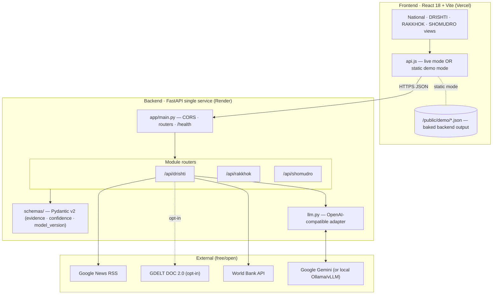
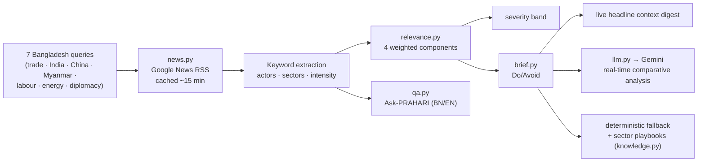
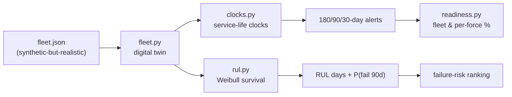
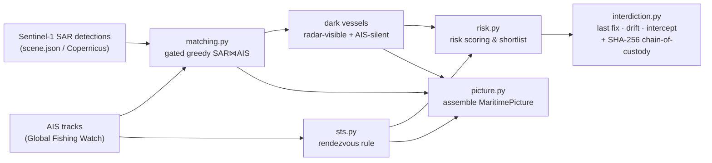

# PRAHARI — System Architecture

> How raw open data becomes a decision with the evidence attached.
> *Built by DatourX for the SciBlitz AI Challenge 2026.*

This document describes **what is actually implemented** in this repository (the MVP), then — clearly separated — the **production architecture roadmap** that is *not yet built*. Nothing in §1–§6 requires a database, a message bus, or a graph store; the MVP runs on **local JSON data files + live public APIs** and a **pluggable LLM adapter**.

---

## 1. What the MVP actually is

PRAHARI is deployed as **two independently deployable halves**:

| Half | Runtime | Hosting | Notes |
|---|---|---|---|
| **Backend** | Python 3.11 · FastAPI · Uvicorn | Render (free plan, `render.yaml`) | One service, three module routers, no database. |
| **Frontend** | React 18 · Vite | Vercel (static bake) | Runs live against the backend *or* fully offline from a baked JSON bundle. |

The backend collapses what a production system would split into microservices into **one FastAPI app** (`app/main.py`) so it runs on a single free URL and stays live for judging. All state is per-request; persistence is the local JSON files under each module's `data/` folder.

**Key design property — never breaks:** the frontend loads an instant baked snapshot (static mode), then upgrades to live data by polling the backend. The backend, in turn, falls back to cached/demo data on any upstream failure, and the LLM adapter falls back to a deterministic grounded output whenever no provider is configured or a call fails. There is no single point that can take the demo down.

---

## 2. The shared explainability core

Every module speaks the same contract, enforced by the Pydantic v2 schemas in `backend/app/schemas/`:

- **`Evidence`** — `{ source, detail, weight, url? }`: one link in the reasoning chain.
- **`AIMeta`** — `{ model_version, confidence (0–1), confidence_label }`: attached to every AI output.
- **Rule:** *no bare numbers.* Every score/verdict ships with `confidence`, `evidence[]`, and `model_version`. Below a confidence floor, a module **refuses** and says why (design law #3).

This is what powers the **Explainability (C3)** surface in the UI — every score, brief, and alert can be expanded to its evidence chain — and the **National Situation (C1)** page, which rolls the three modules into one posture gauge and a unified alert stream.

---

## 3. DRISHTI — geopolitical intelligence pipeline

**Files:** `modules/drishti/{news,gdelt,relevance,brief,knowledge,qa,router}.py`

**Ingestion (`news.py`).** Seven curated queries hit Google News RSS (`news.google.com/rss/search`, keyless), de-duplicated and cached ~15 min. A transparent extractor tags each headline with **actors** (India, China, Myanmar, US, EU, Gulf states, IMF/World Bank…), **policy sectors** (trade, labour, security, energy, water, diplomacy, climate), and a **cooperation/conflict intensity** signal from positive/negative keyword sets. A secondary **GDELT DOC 2.0** path exists in `gdelt.py` behind `DRISHTI_USE_LIVE_GDELT` (off by default).

**Bangladesh Relevance Score (`relevance.py`).** A deliberate, auditable heuristic (not a black box), so an analyst can challenge any number. Four weighted components summing to 1.0:

| Component | Weight | Logic |
|---|---|---|
| Actor relevance | 0.40 | Tiered: Bangladesh direct = 100 · neighbours/top partners (India/China/Myanmar) = 88 · major trade/labour/security partners = 72 · wider actors = 50. |
| Sector relevance | 0.30 | Highest-weight sector touched (RMG trade 1.00, labour/remittance 0.95, security 0.95, water 0.90…). |
| Geographic proximity | 0.15 | Bay of Bengal / Bangladesh territory = 100 · wider South Asia = 65 · global spillover = 30. |
| Event magnitude | 0.15 | From intensity signal — strong cooperation *or* conflict raises significance. |

Score → **RED (≥70) / AMBER (≥45) / GREEN** severity. Confidence reflects input completeness (0.40 → 1.00 as actors/sectors/location/intensity are present).

**Do/Avoid brief (`brief.py`).** Two-column national-interest brief — *situation · why-it-matters · DO · AVOID · hedges · decision window* — with citations. Grounded actions come from **sector playbooks** in `knowledge.py`. The narrative is produced two ways:
- **LLM path** — the model receives the target event *plus a digest of today's live headlines* and produces a **real-time comparative assessment** (how the picture has moved since the event, what partners are doing now). Neutral toward all foreign states; no fabricated statistics; strict `SITUATION:` / `ANALYSIS:` output parsing.
- **Deterministic path** — a grounded narrative from event facts + sector order-effects, used whenever the LLM is unavailable.
- **Refusal** — below the confidence floor (or no mapped sector), it returns `refused=true` with a reason rather than speculate.

**Ask-PRAHARI (`qa.py`).** Bilingual (Bangla/English) Q&A grounded in the current feed by keyword retrieval, mirrored client-side in static mode so the demo answers even with no backend.

---

## 4. RAKKHOK — asset readiness pipeline

**Files:** `modules/rakkhok/{fleet,clocks,rul,readiness,router}.py` · data: `data/fleet.json`

**Service-life clocks (`clocks.py`).** Each asset carries multiple clocks — calendar deadlines and usage counters — each producing a level (red/amber/yellow/green) and days-remaining; the worst clock drives the asset's status. Alerts escalate at the **180 / 90 / 30-day** thresholds.

**RUL (`rul.py`) — Weibull survival analysis.** Component life is modelled as Weibull with a wear-out shape (**k = 2.5**, increasing hazard), scaled to the design limit of the driving usage counter. It reports **RUL in days** (remaining usage ÷ utilization rate) and the **conditional probability of failure within 90 days**, `P(fail before u+h | survived to u) = 1 − S(u+h)/S(u)`, each with its evidence line. Assets with no usage driver fall back to the nearest calendar/consumable deadline.

**Readiness (`readiness.py`).** Rolls asset health into fleet and per-force mission-capable %, plus red/amber alert counts. `/rul-ranking` orders the fleet by 90-day failure probability — the "service this one first" list.

> **Data honesty:** real defense asset data is classified. The fleet is **synthetic-but-realistic**, stated plainly in the UI and docs.

---

## 5. SHOMUDRO — maritime awareness pipeline

**Files:** `modules/shomudro/{picture,matching,sts,risk,interdiction,geo,router}.py` · data: `data/scene.json`

**SAR⋈AIS association (`matching.py`).** For each SAR detection, candidate AIS tracks within a **250 m spatial gate** and a **±30% length gate** are built, then paired by a **greedy nearest-distance assignment** (a transparent stand-in for Hungarian matching). A detection with no valid partner is **DARK** — seen by radar, silent on AIS. Distances use a haversine helper (`geo.py`).

**STS detection (`sts.py`).** Ship-to-ship rendezvous flagged on the classic loitering-encounter rule (close range, near-zero speed, sustained duration).

**Interdiction packet (`interdiction.py`).** For a dark contact or STS event: last fix, drift prediction, nearest patrol asset, intercept bearing/distance/ETA, and a **SHA-256 chain-of-custody hash** for evidence integrity. `picture.py` assembles the unified `MaritimePicture` (AIS + SAR + dark + STS + patrol assets + counts + EEZ bbox) consumed by the map.

---

## 6. Engineering conventions

- **Backend:** Python 3.11+, FastAPI, Pydantic v2; type hints + module docstrings throughout. Config strictly via environment variables (`config.py`); **secrets never committed** (`.env` is gitignored; `.env.example` documents the keys).
- **AI-output contract:** every AI response carries `confidence`, `evidence[]`, and `model_version`. No bare numbers.
- **LLM adapter (`llm.py`):** one thin wrapper over any OpenAI-compatible endpoint, with retry/back-off on rate limits and graceful `None` → deterministic-fallback on any failure. Point `LLM_BASE_URL` at Gemini's OpenAI-compatible endpoint (hosted) or a local Ollama/vLLM server (sovereign / air-gapped).
- **Frontend:** React + Vite, CSS-variable theming (dark default + light), an i18n layer (Bangla/English) from the start, and a self-contained **static demo mode** (`VITE_STATIC_DEMO=1`) reading `/public/demo/*.json`.
- **Tests:** `backend/tests/` (pytest + pytest-asyncio), one suite per module.
- **Data pipeline scripts (`backend/scripts/`):** `fetch_drishti.py` (World Bank + news), `fetch_gfw.py` (Global Fishing Watch AIS), `fetch_sar.py` (Sentinel-1), `capture_ais.py`, `make_sar_visuals.py`, and `export_demo.py` (bakes the exact backend output into the frontend demo bundle). These use `numpy/scipy/tifffile/websockets` from `requirements-dev.txt` — they are *not* runtime dependencies of the API.

---

## 7. Production architecture roadmap — NOT yet implemented

Everything below is **design intent, not present in this repository**. The MVP deliberately runs without any of it.

| Planned component | Purpose | Status |
|---|---|---|
| **Neo4j** | Geopolitical knowledge graph (nations, ministries, ports, treaties; ally/creditor/rival/supplier edges) to enrich relevance scoring. | 🔮 Not built |
| **PostgreSQL + PostGIS** | Geospatial store; versioned EEZ boundary as a reference layer. | 🔮 Not built |
| **TimescaleDB** | AIS / sensor time-series at national scale. | 🔮 Not built |
| **Kafka** | Streaming ingestion bus for continuous 24/7 feeds. | 🔮 Not built |
| **Vector search + RAG** | Precedent retrieval to further ground Do/Avoid briefs. | 🔮 Not built |
| **CV training (SAR)** | YOLO-family vessel detection trained on labelled SAR datasets, replacing the bundled demo scene. | 🔮 Not built |
| **Local open-weight LLMs** | Fully air-gapped, in-country inference (the `llm.py` adapter already supports this path today). | ⚙️ Adapter-ready |
| **Zero-trust security envelope** | RBAC + MFA, per-classification network segmentation, immutable hash-chained audit log. | 🔮 Not built |

**Evaluation targets** for the P1+ ML upgrades (aspirational, for planning): event-extraction F1 vs. a hand-labelled set; nDCG of the relevance ranking vs. expert judgement; citation-validity and expert-panel review of Do/Avoid briefs; SAR detection F1 (incl. close-to-shore); SAR⋈AIS match accuracy vs. ground truth; STS precision on GFW encounters; RUL RMSE **and alert lead-time** (a late-but-accurate alert is useless to a maintenance officer).

---

*© 2026 DatourX — licensed under AGPL-3.0. See [`../LICENSE`](../LICENSE).*
